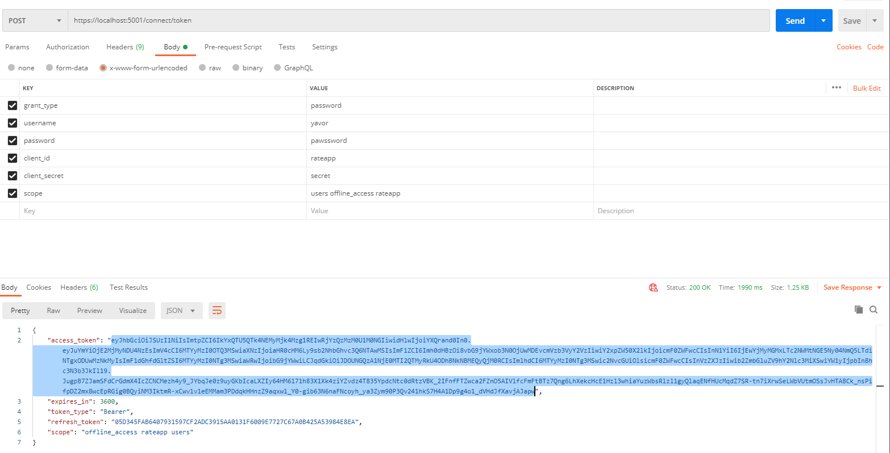
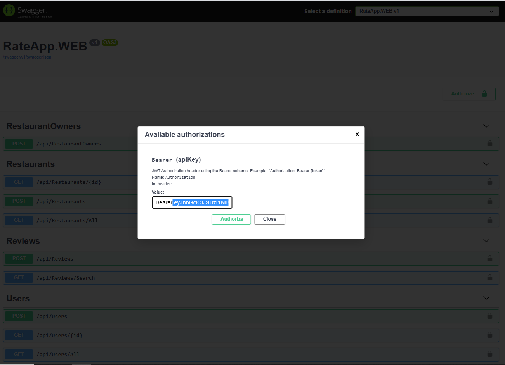

## Instructions on obtaining token
- using postman 

- using c# RestSharp 
``` CSharp 
var client = new RestClient("https://localhost:5001/connect/token");
client.Timeout = -1;
var request = new RestRequest(Method.POST);
request.AddHeader("Content-Type", "application/x-www-form-urlencoded");
request.AddParameter("grant_type", "password");
request.AddParameter("username", "yavor");
request.AddParameter("password", "pawssword");
request.AddParameter("client_id", "rateapp");
request.AddParameter("client_secret", "secret");
request.AddParameter("scope", "users offline_access rateapp");
IRestResponse response = client.Execute(request);
Console.WriteLine(response.Content);
```
- using cURL
```bash
 curl --location --request POST 'https://localhost:5001/connect/token' 
--header 'Content-Type: application/x-www-form-urlencoded' 
--data-urlencode 'grant_type=password' 
--data-urlencode 'username=yavor' 
--data-urlencode 'password=pawssword' 
--data-urlencode 'client_id=rateapp' 
--data-urlencode 'client_secret=secret' 
--data-urlencode 'scope=users offline_access rateapp'
```
-using PowerShell
```PowerShell
$headers = New-Object "System.Collections.Generic.Dictionary[[String],[String]]"
$headers.Add("Content-Type", "application/x-www-form-urlencoded")

$body = "grant_type=password&username=yavor&password=pawssword&client_id=rateapp&client_secret=secret&scope=users%20offline_access%20rateapp"

$response = Invoke-RestMethod 'https://localhost:5001/connect/token' -Method 'POST' -Headers $headers -Body $body
$response | ConvertTo-Json
```

## Instructions on using the token
